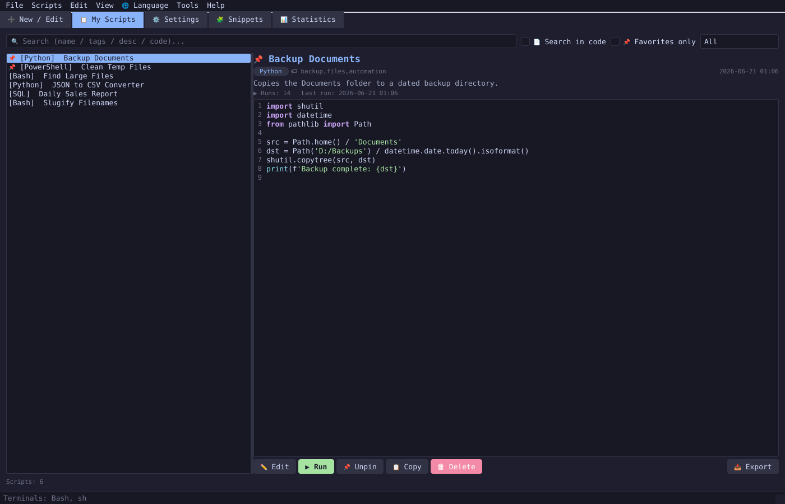

# 🗄️ ScriptDataBase Lite

A lightweight desktop app for storing, organizing, and running your scripts — Python, Bash, PowerShell, Batch, JavaScript, SQL, VBScript, Ruby, Lua, and more — from one searchable library.




## Overview

ScriptDataBase Lite is a PyQt6 desktop application for developers and power users who collect a lot of small utility scripts and need a fast way to find, edit, and run them again. Instead of digging through scattered folders, scripts live in one searchable library with syntax highlighting, tags, categories, run statistics, and one-click execution in your terminal of choice. The app is organized into five tabs — **New/Edit**, **My Scripts**, **Settings**, **Snippets**, and **Statistics** — all reachable from the tab bar, the menu, or their keyboard shortcuts.

## Features

### ➕ New / Edit — script editor

- Form fields for **name**, **category** (one of the ten supported languages), comma-separated **tags**, and a short **description**.
- A full-featured code editor (`QPlainTextEdit`-based) with **line numbers**, a fixed-pitch monospace font, and **Ctrl+H** to open Find/Replace directly from the editor.
- **Auto-detect language**: scans the pasted code against a set of regex patterns (shebangs, keywords, syntax idioms) and sets the category — and the matching syntax highlighter — automatically. The same detection runs when you open a file with **Ctrl+O**.
- **Syntax highlighting** that switches live as soon as the category changes.
- **Find / Replace** (`Ctrl+H`): case-sensitive, whole-word, and regular-expression search modes; replace one match or **replace all** in a single undoable edit block, with a counter of how many replacements were made.
- **Diff preview**: while editing an existing script, "📊 Podgląd zmian" opens a unified-diff view comparing the last saved version against your current edits, with added/removed lines color-coded and a summary count. (Disabled for brand-new scripts that haven't been saved yet.)
- **Unsaved-changes tracking**: the status bar shows live line/character counts, and the tab/app refuses to discard edits without confirmation (on clearing the editor, switching away, or closing the app).
- **Duplicate-name guard**: saving a new script under a name that already exists in the library asks for confirmation before creating a second entry.
- **Export from editor**: save the current editor contents straight to a file (with the correct extension for the selected category) independent of saving it to the library.
- **Copy code** to the clipboard, or **Clear** the editor (with a confirmation if there are unsaved changes).

### 📋 My Scripts — library, search & run

- Split view: a filterable list on the left, a live preview with syntax-highlighted code on the right.
- **Search** across name, tags, and description, with a 150 ms debounce so typing stays responsive; an optional **"Search in code"** toggle extends the search into the full script body and highlights matched terms (both in the list and inside the code preview).
- **Category filter** dropdown and a **"Favorites only"** toggle to narrow the list.
- **Pinned/favorite scripts** (`📌`) always float to the top of the list, independent of the current sort or filter.
- Preview pane shows category, tags, date, description, and run statistics (run count + last-run timestamp) alongside the read-only, syntax-highlighted code.
- Per-script actions, available as buttons, a right-click context menu, or double-click to edit: **Edit**, **Run**, **Pin/Unpin**, **Copy code**, **Duplicate** (creates an independent copy with its own reset statistics), **Export to file**, and **Delete** (with an optional confirmation prompt, toggleable in Settings).
- Script count is always shown at the bottom of the list.

### ▶ Running scripts

- Launch the **Run** dialog for any selected script, or run the script currently open in the editor with **Ctrl+Enter** without having to save it first.
- The script is written to a temporary file with the correct extension and executed; optional command-line **arguments** can be supplied.
- **Python scripts** run in a background thread so the UI stays responsive, with output **streamed line-by-line** as it's produced (rather than waiting for the process to finish), a built-in **30-second timeout** that kills runaway processes, and a **Stop** button to cancel manually.
- **Other languages** (Bash, PowerShell, Batch, etc.) are launched in an auto-detected system terminal — the app probes for CMD, PowerShell, PowerShell Core, Bash, sh, Zsh, and WSL on startup (**Tools → 🔄 Detect terminals** to re-scan) and lets you pick which one to use.
- An option to automatically delete the temporary script file once execution finishes (on by default).
- Every successful run updates that script's run count and last-run timestamp, feeding into the Statistics tab.

### 🧩 Snippets — reusable code fragments

- An independent mini-library (separate `snippets.json` file) for short, reusable pieces of code — boilerplate, one-liners, idioms — kept apart from your full scripts.
- Its own search box and category filter, plus a dedicated syntax-highlighted editor for creating and updating snippets.
- **"⏎ Insert into editor"** drops the snippet's code into the main New/Edit editor at the current cursor position and switches you to that tab; double-clicking a snippet in the list does the same.
- **"🧩 Save selection as snippet"** (Edit menu) sends the selected text — or the whole script if nothing is selected — from the main editor straight into a new snippet.
- New, Save, Insert, Copy, and Delete actions, plus a right-click context menu.
- Theme and editor font follow the same settings as the rest of the app.

### 📊 Statistics

- Available both as a permanent tab and as a quick modal dialog (**Tools → Statistics**, `Ctrl+T`).
- A summary line with total scripts, number of pinned favorites, and total runs across the whole library.
- **Scripts by category** — a breakdown table sorted by count.
- **Most-run scripts** — top 10 by run count.
- **Pinned scripts** — a quick list of everything currently marked as a favorite.
- A **Refresh** button on the tab rebuilds all three lists from the current data.

### ⚙️ Settings

- **Theme**: switch between dark and light at any time; applies instantly across every editor and preview.
- **Language**: toggle the whole interface between Polish and English (the app restarts to apply it, with a confirmation prompt first).
- **Editor font**: choose the family (Consolas, Courier New, Fira Code, JetBrains Mono, Cascadia Code, Monospace) and size (7–24pt); applied immediately to the New/Edit editor, the My Scripts preview, and the Snippets editor.
- **Confirm before delete**: toggle whether deleting a script asks for confirmation first.
- **Tab order**: reorder the five main tabs either by dragging items in a list in Settings or by dragging the tabs themselves on the main tab bar — both stay in sync, and the order is remembered between sessions.
- **Reset to defaults** restores the default theme, font, and tab order.
- Settings are saved explicitly with a **Save settings** button (or automatically when changing theme/language), and persisted to `settings.json`.

### 📥📤 Import / Export

- **Import scripts (JSON)**: load a JSON array of scripts, with per-record validation — missing `name`/`code` fields are reported, unknown categories are silently coerced to "Other", and you get a summary of how many records failed before choosing whether to import the valid ones anyway. Duplicate IDs already in your library are skipped automatically.
- **Export all (JSON)**: dump the entire library to a single JSON file.
- **Export all (ZIP)**: write every script out as an individual file, sorted into per-category subfolders (e.g. `Python/backup_documents.py`), with automatic handling of duplicate filenames within a category, plus a `_metadata/scripts.json` containing the full records.
- **Export from editor** and **per-script export** (described above) let you save individual scripts to disk at any time.
- **Open data folder** jumps straight to where all the JSON files live.

### 🌐 Interface & customization

- Full **dark and light themes**.
- **Polish and English** UI translations, switchable from the Language menu or Settings.
- **Movable tabs** — drag tabs on the bar itself, in addition to the Settings list method above.
- Window size and position are remembered between sessions and restored centered on screen.

### 🛡️ Data integrity & storage

- All data is plain local JSON, with **atomic writes** (written to a temp file, then renamed into place) so an interruption mid-save can't corrupt your library.
- If a data file is found corrupted on load, it's backed up with a timestamped filename instead of being silently discarded, and the issue is logged.
- Automatic **backward-compatibility migration**: older `scripts.json` files missing the pinned/run-count/last-run fields are patched on startup.
- Script IDs are UUID4, eliminating collisions from rapid bulk creation.

| File | Contents |
|---|---|
| `scripts.json` | Your script library |
| `snippets.json` | Saved code snippets |
| `settings.json` | Theme, language, font, tab order, and other preferences |

### ℹ️ About dialog

Shows the app version, author and contact details, license, and live environment info (Python version, OS platform, and the active data directory) — accessible from **Help → About**.

## Requirements

- Python 3.10+
- [PyQt6](https://pypi.org/project/PyQt6/)

```bash
pip install PyQt6
```

## Getting Started

```bash
python ScriptDataBase.py
```

On first launch, the app creates its data directory and starts with an empty library — just add your first script from the **New / Edit** tab.

## Keyboard Shortcuts

| Shortcut | Action |
|---|---|
| `Ctrl+N` | New script |
| `Ctrl+O` | Open a file into the editor |
| `Ctrl+S` | Save script |
| `Ctrl+Enter` | Run current script from the editor |
| `Ctrl+E` | Edit selected script |
| `Ctrl+R` | Run selected script |
| `Ctrl+Shift+C` | Copy selected script's code |
| `Ctrl+P` | Pin / unpin selected script |
| `Delete` | Delete selected script |
| `Ctrl+H` | Find / Replace in editor |
| `Ctrl+T` | Open Statistics |
| `Alt+F4` | Quit |

## Supported Script Categories

| Category | Extension |
|---|---|
| Python | `.py` |
| Bash | `.sh` |
| PowerShell | `.ps1` |
| Batch | `.bat` |
| JavaScript | `.js` |
| SQL | `.sql` |
| VBScript | `.vbs` |
| Ruby | `.rb` |
| Lua | `.lua` |
| Other | `.txt` |

## License

Freeware. Free to use and redistribute unmodified, with author attribution retained.

## Author

**Sebastian Januchowski** — polsoft.ITS™ Group
[GitHub](https://github.com/polsoft-seb07uk) · [polsoft.its@fastservice.com](mailto:polsoft.its@fastservice.com)
